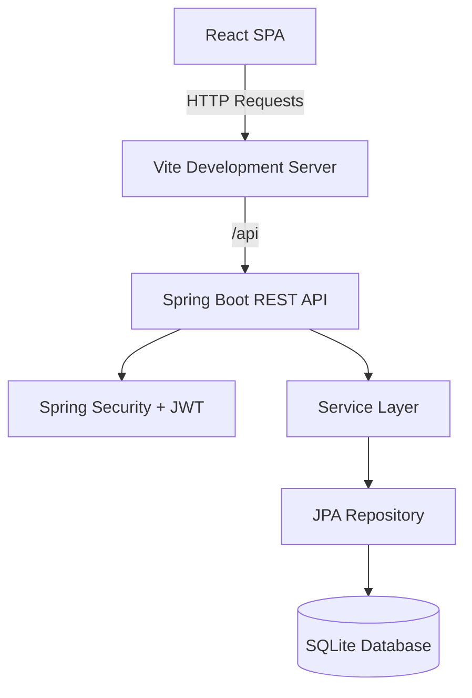

# 🚗 Car Dealership Inventory System

A modern, full-stack **Car Dealership Inventory Management System** developed as part of the **Incubyte TDD Kata**. The application enables customers to browse, search, and purchase vehicles while providing administrators with a secure dashboard to manage inventory, restock vehicles, and monitor purchase history.

The project follows modern software engineering practices, including **RESTful API development**, **JWT authentication**, **role-based authorization**, **responsive frontend development**, and **Test-Driven Development (TDD)**.

---

# ✨ Features

## 🔐 Authentication

* User Registration
* User Login
* JWT Token Authentication
* Secure Password Encryption (BCrypt)
* Role-Based Authorization (Admin & Customer)

---

## 🚗 Vehicle Inventory

* Browse all available vehicles
* Responsive vehicle listing
* View detailed vehicle information
* Search by:

  * Make
  * Model
  * Category
  * Minimum Price
  * Maximum Price
* Live dashboard statistics
* Automatic stock updates

---

## 🛒 Purchase System

* Purchase available vehicles
* Customer purchase form
* Stores customer information:

  * Name
  * Email
  * Phone Number
  * Address
* Automatically decreases inventory
* Purchase button automatically disables when stock reaches zero

---

## 👨‍💼 Admin Dashboard

Administrators can:

* Add new vehicles
* Update vehicle details
* Delete vehicles
* Restock vehicle inventory
* View customer purchase history
* Track:

  * Customer Name
  * Purchased Vehicle
  * Purchase Date
  * Purchase Time

---

## 🎨 User Interface

* Modern Glassmorphism Design
* Fully Responsive Layout
* Gradient Backgrounds
* Smooth Animations
* Loading Skeletons
* Interactive Cards
* Clean Navigation
* Mobile Friendly

---

# 🛠️ Tech Stack

## Backend

* Java 21
* Spring Boot
* Spring Security
* Spring Data JPA
* JWT Authentication
* SQLite
* Maven

---

## Frontend

* React
* Vite
* React Router
* React Hook Form
* Axios
* CSS3

---

## Database

* SQLite

---

# 🏗️ Project Architecture



---

# 📂 Project Structure

```
CarDealershipInventory

│
├── backend
│   ├── config
│   ├── controller
│   ├── dto
│   ├── entity
│   ├── repository
│   ├── security
│   ├── service
│   └── tests
│
├── frontend
│   ├── src
│   │   ├── components
│   │   ├── pages
│   │   ├── services
│   │   ├── hooks
│   │   └── styles
│   └── tests
│
├── screenshots
│
├── README.md
└── TEST_REPORT.md
```

---

# 🗄️ Database Schema

The application stores data in SQLite using the following tables:

### Users

* id
* name
* email
* password
* role

### Vehicles

* id
* make
* model
* category
* price
* quantity

### Purchases

* id
* customerName
* customerEmail
* phoneNumber
* address
* purchaseDate
* purchaseTime
* vehicleId

---

# 🔒 Security Features

* JWT Authentication
* BCrypt Password Encryption
* Stateless Authentication
* Spring Security
* Protected REST APIs
* Role-Based Authorization
* Admin-only Operations

---

# 🌐 REST API

## Authentication

### Register

```
POST /api/auth/register
```

### Login

```
POST /api/auth/login
```

---

## Vehicles

### Get All Vehicles

```
GET /api/vehicles
```

### Search Vehicles

```
GET /api/vehicles/search
```

### Add Vehicle (Admin)

```
POST /api/vehicles
```

### Update Vehicle (Admin)

```
PUT /api/vehicles/{id}
```

### Delete Vehicle (Admin)

```
DELETE /api/vehicles/{id}
```

---

## Inventory

### Purchase Vehicle

```
POST /api/vehicles/{id}/purchase
```

### Restock Vehicle

```
POST /api/vehicles/{id}/restock
```

---

## Purchase History

```
GET /api/purchases
```

---

# 🚀 Local Setup

## Prerequisites

* Java JDK 21+
* Node.js 18+
* npm
* Git

---

## Backend Setup

Navigate to the backend directory:

```bash
cd carinventory_backend
```

Run the Spring Boot application:

```bash
./mvnw spring-boot:run
```

The backend runs on:

```
http://localhost:8081
```

The SQLite database (`car_inventory.db`) is automatically created and seeded during startup.

---

## Frontend Setup

Navigate to the frontend directory:

```bash
cd carinventory_frontend
```

Install dependencies:

```bash
npm install
```

Start the development server:

```bash
npm run dev
```

The frontend runs on:

```
http://localhost:3000
```

All `/api` requests are automatically proxied to the backend.

---

# 👤 Test Accounts

The application automatically seeds the database with the following users:

| Role     | Email                  | Password      |
| -------- | ---------------------- | ------------- |
| Customer | `user@dealership.com`  | `password123` |
| Admin    | `admin@dealership.com` | `password123` |

---

# 🔄 Application Workflow

## Customer Workflow

Register

↓

Login

↓

Browse Vehicles

↓

Search & Filter

↓

View Vehicle Details

↓

Fill Purchase Form

↓

Purchase Vehicle

↓

Inventory Updated

---

## Administrator Workflow

Login

↓

Dashboard

↓

Add Vehicle

↓

Update Vehicle

↓

Delete Vehicle

↓

Restock Inventory

↓

View Purchase History

---

# 🧪 Running Tests

## Backend Tests

Run all backend unit tests:

```bash
cd carinventory_backend
./mvnw test
```

The backend test suite includes tests for:

* Authentication
* JWT Security
* Vehicle CRUD
* Search Functionality
* Purchase Logic
* Restock Logic
* Controllers
* Services
* Repository Layer

---

## Frontend Tests

Run all frontend tests:

```bash
cd carinventory_frontend
npm run test
```

The frontend test suite covers:

* Login Page
* Registration Page
* Dashboard
* Vehicle Cards
* Search Components
* Route Protection
* Form Validation

---

# 📊 Test Coverage

The project includes comprehensive automated tests covering:

* User Authentication
* Authorization
* Vehicle CRUD Operations
* Purchase Functionality
* Inventory Management
* Search & Filtering
* API Endpoints
* Frontend Components
* Form Validation
* Protected Routes

---

# 📸 Screenshots

The `/screenshots` directory contains images of:

* Login Page
* Registration Page
* Dashboard
* Vehicle Listing
* Search & Filter
* Vehicle Details
* Purchase Form
* Admin Dashboard
* Add Vehicle
* Edit Vehicle
* Purchase History

---

# 🤖 My AI Usage

## AI Tools Used

* ChatGPT
* Claude / Antigravity Assistant

---

## How AI Was Used

AI was used responsibly throughout the project to improve development efficiency while ensuring all final implementations were reviewed, understood, and tested before integration.

Examples include:

* Generating Spring Boot boilerplate
* Designing REST API structure
* Creating DTO classes
* Debugging Spring Security and JWT configuration
* Building responsive React components
* Improving UI/UX design
* Writing unit test templates
* Debugging frontend rendering issues
* Optimizing application architecture
* Assisting with project documentation

Every AI-generated suggestion was manually reviewed, modified where necessary, tested thoroughly, and integrated into the final application.

---

## Reflection

Using AI significantly accelerated repetitive development tasks such as boilerplate generation, debugging, and documentation. It allowed greater focus on designing clean architecture, implementing business logic, improving user experience, and maintaining high code quality. All architectural decisions, business logic, testing, and final integration were completed and validated manually.

---

# 🚀 Future Enhancements

* Online Payment Integration
* Vehicle Image Upload
* Email Notifications
* Vehicle Reservation System
* Sales Analytics Dashboard
* Export Purchase Reports
* Cloud Deployment (AWS, Render, Railway)
* Docker Support
* CI/CD Pipeline
* Advanced Filtering & Sorting

---

# 👨‍💻 Development Practices

This project follows modern software engineering principles:

* Test-Driven Development (TDD)
* SOLID Principles
* Clean Code Practices
* RESTful API Design
* Component-Based Frontend Architecture
* Role-Based Access Control
* Git Version Control
* Responsive Design
* Modern UI/UX Principles

---

# 📄 License

This project was developed as part of the **Incubyte TDD Kata** for educational and assessment purposes.

---

# 👤 Author

**Kanisha Jasoliya**

Incubyte TDD Kata Submission
