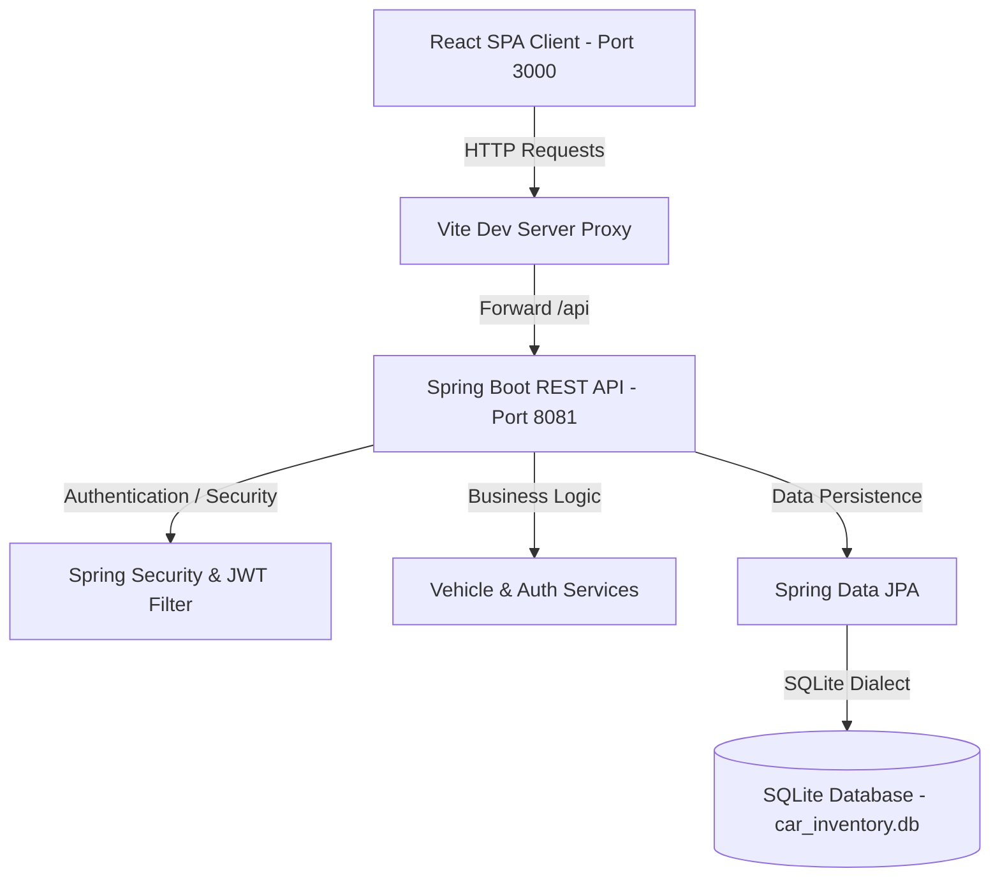

# Car Dealership Inventory System

A robust, modern full-stack single-page application (SPA) to manage a vehicle showroom inventory. Built using Spring Boot (Java 21, Security, JPA, SQLite, JWT) on the backend and React (Vite, React Router, React Hook Form, Axios) on the frontend.

## Key Features
- **User Authentication**: Register & login with token-based JWT security.
- **Showroom Dashboard**: Live stats summary (total vehicles count, total portfolio value, unique categories count) and a listing grid.
- **Unified Filtering**: Search and filter the catalog by brand, model, year, and price range.
- **Purchase Action**: Instantly purchase vehicles (decrements inventory count; disables at 0 stock).
- **Admin Dashboard**:
  - Add new vehicles with real-time field validation.
  - Modify details of existing vehicles.
  - Restock vehicles (increments inventory count).
  - Delete vehicles from the showroom fleet.
- **Visual Design**: High-fidelity dark mode with glassmorphic cards, gradient accents, loading skeletons, responsive grid layouts, and fluid micro-animations.

---

## Technical Architecture



---

## Local Setup and Installation

### Prerequisites
- **Java JDK 21** or higher
- **Node.js** v18+ and **npm**

### Step 1: Run the Backend API
1. Navigate to the backend directory:
   ```bash
   cd carinventory_backend
   ```
2. Build and run the Spring Boot application using the Maven wrapper:
   ```bash
   ./mvnw spring-boot:run
   ```
*Note: The backend will start on **port 8081** and automatically initialize and seed the SQLite database file `car_inventory.db` in the backend directory.*

### Step 2: Run the Frontend Client
1. Navigate to the frontend directory:
   ```bash
   cd carinventory_frontend
   ```
2. Install npm dependencies:
   ```bash
   npm install
   ```
3. Start the Vite development server:
   ```bash
   npm run dev
   ```
*Note: The frontend server starts on **port 3000** and proxies `/api` calls to the backend on `8081`.*

---

## Test Accounts

The database seeder automatically populates the system with two test users:

| Role | Username | Password |
|------|----------|----------|
| **Standard User** | `user@dealership.com` | `password123` |
| **Admin User** | `admin@dealership.com` | `password123` |

---

## Running Test Suites

### Backend Unit Tests
To run the Spring Boot JUnit test suite (includes 36 tests covering Auth/Vehicle controllers, services, and search queries):
```bash
cd carinventory_backend
./mvnw test
```

### Frontend Unit Tests
To run the Vitest suite (includes 16 tests covering Login, Register, Dashboard, and VehicalCard components):
```bash
cd carinventory_frontend
npm run test
```

---

## My AI Usage

### 1. Tools Used
- **Claude / Gemini (Antigravity Assistant)**: Co-authored codebase structure, designed CSS styling system, wrote unit tests, and resolved locale-based test formatting errors.

### 2. How They Were Used
- **Boilerplate & Architecture**: Used to generate standard DTO classes (`UserProfileResponse`) and database seeder (`DatabaseSeeder.java`).
- **CSS Design System**: Engineered a custom glassmorphism design sheet from scratch, leveraging CSS variables to make theme tweaking straightforward.
- **Unit Testing**: Generated mocks for `useAuth` contexts and router components to verify validation errors, loading skeletons, and role-based toggle permissions.
- **Debugging**: Analyzed the test output where system locales caused comma-versus-period formatting mismatches in currency rendering, and fixed it by declaring a strict `'en-US'` formatting standard.

### 3. Reflections on Workflow Impact
Using AI allowed for a rapid loop of Red-Green-Refactor development:
- The backend DTO expansion compile-tested cleanly on the first run.
- Building high-quality mock data was expedited, allowing focus on handling edge conditions (e.g. disabling purchase buttons on exact zero boundaries, validation triggers on empty submissions).
- The transition between Spring Security context configuration and client-side route protection wrappers was bridged seamlessly.
